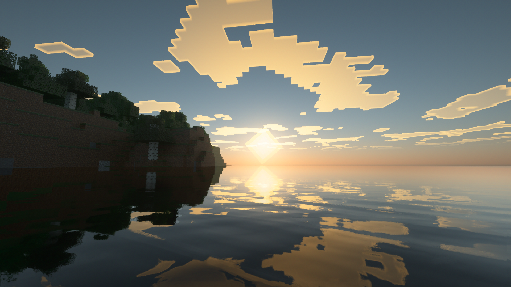
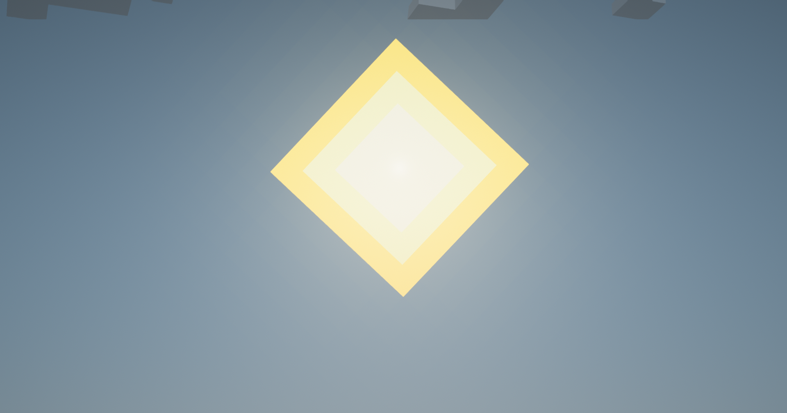
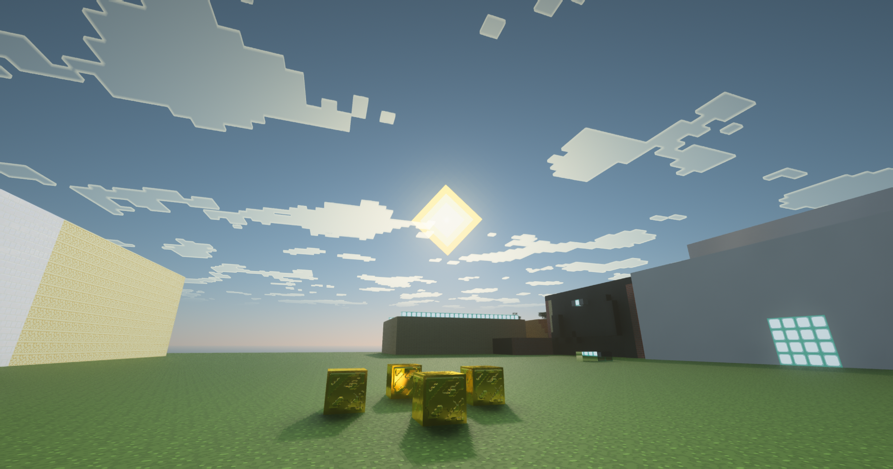
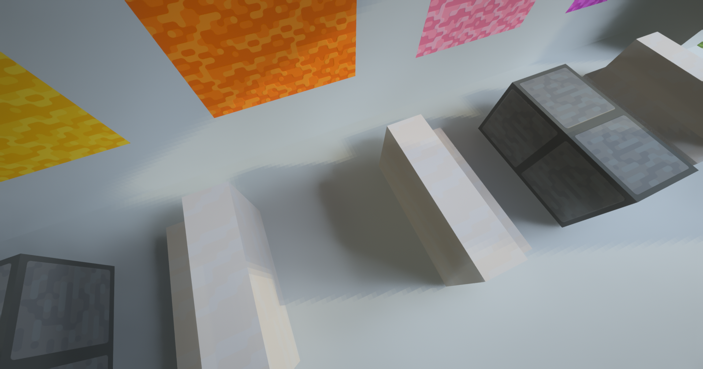
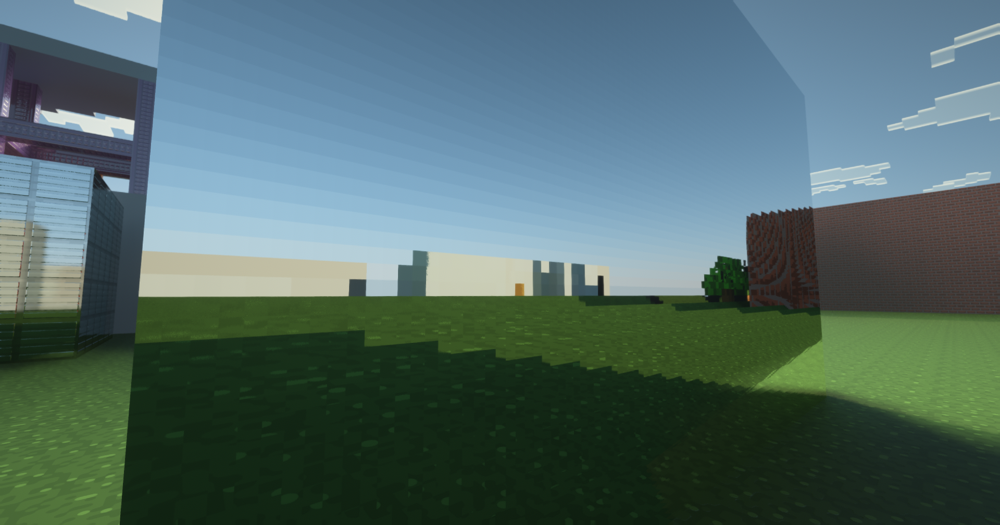

## Downloads

* **Original Shader:** [SEUS PTGI HRR 2.1](https://www.patreon.com/file?h=45141775&m=88959035)
* **Patch File:** Download the `.bin` patch file from the [release section](https://github.com/TranChiHaoVN/SeusPtgiGFMEKEVED/releases/) of this repository.

---

## Installation Steps

1.  Navigate to the **Patcher Site**: [https://projects.jbritain.net/patchbin/](https://projects.jbritain.net/patchbin/)
2.  **Upload Original File:** Under "Original File," select the `SEUS PTGI HRR 2.1 zip` file you downloaded.
3.  **Upload Patch File:** In the "Patch File" section, upload the `.bin` file you downloaded from our releases.
4.  **Apply Patch:** Click the "Apply patch" button. A new patched `.zip` file will automatically download.
5.  **Install Shader:** Drag and drop this newly downloaded `.zip` file into your Minecraft `shaderpacks` folder.

You're all set!

---

## Credits

* **Josh:** For the amazing [patcher website](https://projects.jbritain.net/patchbin/)!
* **GeforceLegend:** For the [base edited SEUS shader!](https://github.com/GeForceLegend/SEUS_PTGI_GFME)

---

## License

### What You **Cannot** Do:

* Directly redistribute this shader.
* Claim this patch or the patched shader as your own work.
* Perform any actions that violate the original SEUS license.

### What You **Can** Do:

* Edit and redistribute the shader with your **own `.bin` patch**, provided it does not violate the original SEUS license.
* Use this shader for gameplay, videos, photos, and live streams.

### Unspecified Use and Licensing

Any purposes not explicitly covered by the SEUS license are subject to its terms. If a purpose remains unclaimed by the SEUS license, it falls under **All Rights Reserved**.

